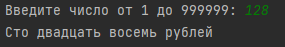
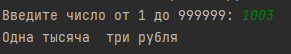
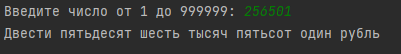

Разработал Гвоздев А.М. Фт-210008
---
---
Пользователь вводит число от 1 до 999999 (сумму выдачи в банкомате). Необходимо вывести на экран словами введенную сумму и в конце написать название валюты (рубли) с правильным окончанием.
Например: 7431 – семь тысяч четыреста тридцать один рубль, 2149 – две тысячи сто сорок девять рублей, 15 – пятнадцать рублей, 3 – три рубля.

Задание со звездочкой: первое слово с большой буквы. 

---
Открывать файл main.py в любой IDE поддерживающей Python
---
---
Примеры работы программы

